# Building AI-Friendly Software Architecture

Presentation outline for a 40–50 minute talk with a flexible number of slides.

The main narrative contains 50 slides. The extended section adds optional slides for a deeper technical discussion, especially around agent observability and OpenTelemetry. The deck can therefore be presented as a 50-slide version or expanded to approximately 70 slides depending on the audience and time available.

All slide copy is written in English. The visual notes describe diagrams to create later; they do not attempt to draw the diagrams.

## Storyline

1. AI is joining the team.
2. AI needs context to understand software.
3. Context must be connected and discoverable.
4. Observability is part of that context.
5. Context can be decomposed into specialized skills.
6. Agents need tools, boundaries, and guardrails.
7. This changes how we deliver software.

## Slide outline

### 1. Title

**Building AI-Friendly Software Architecture**

Subtitle:

**Designing systems that humans and AI agents can understand, explore, and change safely**

Visual: simple architecture diagram with a human developer and an AI agent looking at the same system.

Source: [Article 1](https://luizschons.com/seu-software-est-pronto-para-ser-entendido-por-uma-ia)

---

### 2. About me

**Luiz Schons**

Senior Software Engineer

Visual: minimal speaker introduction. Use a portrait or a simple personal timeline.

---

### 3. The central question

**Is your software ready to be understood by an AI?**

Visual: AI agent entering an unfamiliar software system.

---

### 4. A new person joins the company

**Imagine a new engineer joining your team**

They need to understand:

- The domain
- The systems
- The decisions
- The operational reality

Visual: new person navigating a complex office or system map.

---

### 5. How new people learn systems

**People need paths to discover knowledge**

Diagram example:

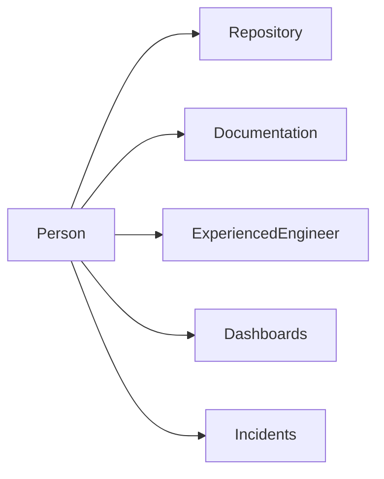

---

### 6. AI faces the same problem

**An agent also needs to discover context**

Visual: compare two onboarding journeys:

- Experienced engineer
- AI agent

Show both trying to answer the same question.

---

### 7. The common diagnosis

**“The model is not good enough”**

Visual: an error pointing toward an AI model, while the real problem is hidden in the system context.

---

### 8. The deeper problem

**The system was designed for people who already know the context**

Visual: experienced engineer taking a shortcut through the system while the AI agent faces a maze.

---

### 9. What experienced engineers already know

**Experienced engineers know where to look**

Show a compact diagram containing:

- Documentation
- ADRs
- Service ownership
- Incident history
- Metrics
- Business rules

---

### 10. What the agent sees

**The same information may exist, but remain disconnected**

Visual: scattered repositories, dashboards, tickets, incidents, and conversations with no links between them.

---

## Part 2 — Code is not context

### 11. Code is only part of the story

**Code shows implementation**

**It does not always explain:**

- Why the decision exists
- Which trade-offs were accepted
- Which constraints matter
- How the system behaves in production

Visual: repository on one side, missing context represented by empty spaces around it.

Source: [Article 2](https://luizschons.com/code-is-not-context-designing-a-context-architecture-for-agents)

---

### 12. A mature system lives in many places

**The system exists beyond the repository**

Visual: central system connected to:

- Code
- Documentation
- ADRs
- Tickets
- Incidents
- Dashboards
- Team knowledge

---

### 13. Information is not context

**Having information is not the same as having context**

Visual: disconnected puzzle pieces versus a connected map.

---

### 14. The context architecture

**Context Architecture connects the sources that explain a system**

Diagram example:

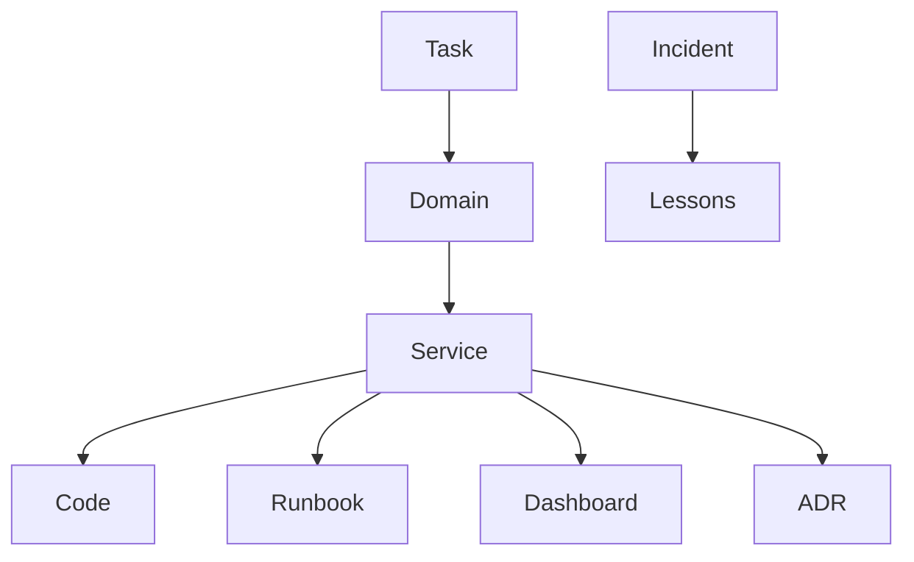

---

### 15. The questions context should answer

**A useful context architecture helps answer:**

- What is this service responsible for?
- Which systems depend on it?
- Why was it built this way?
- How do we know it is working?
- What happened the last time it changed?

Visual: one question at the center with paths leading to different sources.

---

### 16. Context does not need one home

**The goal is not to centralize knowledge**

**The goal is to make it easy to find**

Visual: distributed sources connected by trusted links.

---

### 17. Example: a payments domain

**One domain, multiple sources**

Diagram example:

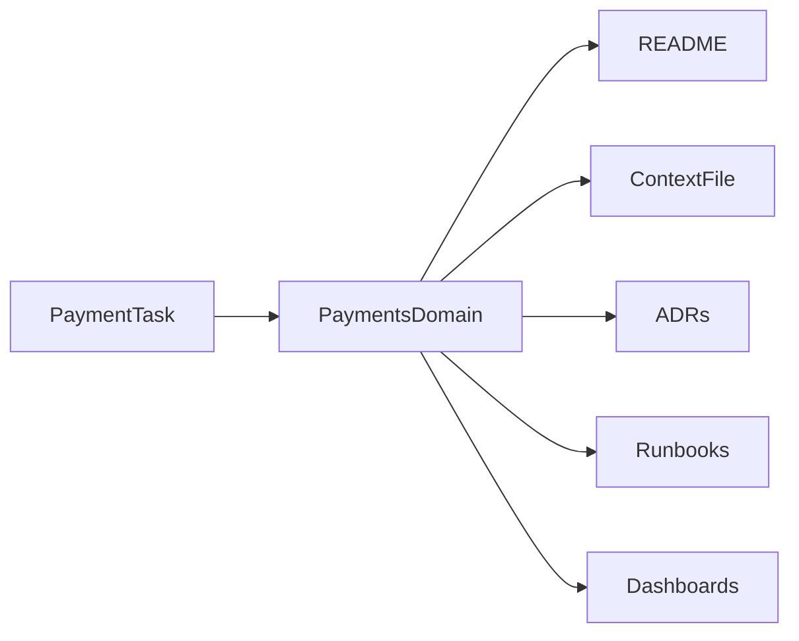

---

### 18. The trusted index

**A small index can connect the system’s knowledge**

Possible file labels:

- `README.md`
- `context.md`
- `links.md`
- `runbook.md`

Visual: show `links.md` as an entry point, not as a copy of every document.

---

### 19. Context needs an owner

**Documentation without ownership becomes outdated**

Visual: every context source connected to:

- Owner
- Last updated
- Source of truth
- Validity signal

---

### 20. Architectural decisions explain the “why”

**Current code shows the result**

**An ADR explains the decision**

Visual: timeline:

```text
Problem → Options → Trade-offs → Decision → Expected result
```

---

### 21. Context should follow the workflow

**Context is created while work happens**

Diagram example:

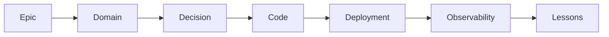

---

### 22. The new-person test

**Could a new engineer complete this task without asking for directions?**

Visual: checklist with five questions:

- What needs to change?
- Who owns it?
- Which decisions constrain it?
- How do we verify it?
- Where do we investigate failure?

---

## Part 3 — Observability as context

### 23. Production behavior is part of the system

**Code explains what should happen**

**Observability shows what actually happens**

Visual: code path on the left and production signals on the right.

Source: [Article 3](https://luizschons.com/observability-is-also-context-for-ai-agents)

---

### 24. Observability is also context for AI

**Logs, metrics, and traces help agents understand reality**

Visual: agent correlating:

- Logs
- Metrics
- Traces
- Deployments
- Incidents

---

### 25. Incident investigation without context

**The agent may search the wrong places**

Visual: agent looking at unrelated dashboards and logs.

---

### 26. Incident investigation with context

**The workflow becomes evidence-driven**

Diagram example:

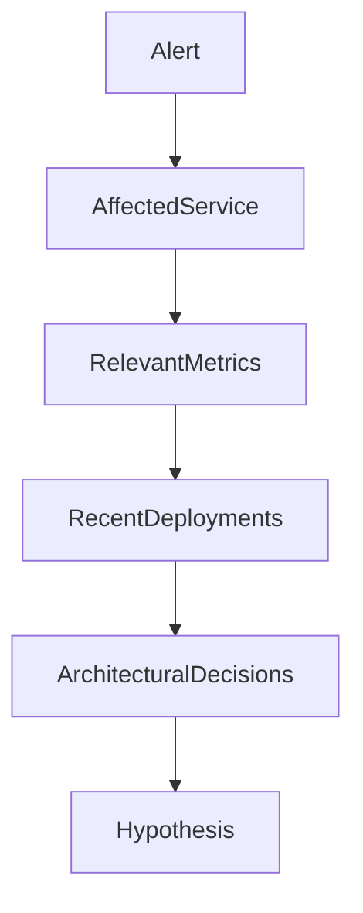

---

### 27. Context changes over time

**Signals need time, ownership, and meaning**

Visual: a metric with annotations for:

- Deployment
- Incident
- Configuration change
- Recovery

---

### 28. Observability needs agent context too

**The agent’s work must also be observable**

Visual: two layers:

1. System observability
2. Agent observability

---

### 29. What should we measure?

**Agent activity is not enough**

Possible measures:

- Context consulted
- Tools invoked
- Evidence collected
- Actions proposed
- Human approvals
- Final outcome

Visual: activity-to-outcome funnel.

---

## Part 4 — Specialized context

### 30. The context monolith

**One giant instruction file eventually becomes a problem**

Visual: oversized `AGENTS.md` file containing every domain, rule, tool, and process.

Source: [Article 6](https://luizschons.com/context-skills-breaking-down-the-context-for-ai-agents)

---

### 31. What microservices taught us

**Boundaries make systems easier to understand**

Visual: one large system decomposed into bounded contexts.

---

### 32. Context can also be decomposed

**Agents do not need every instruction at the same time**

Visual: one large context block splitting into specialized blocks.

---

### 33. What is a Context Skill?

**A Context Skill packages specialized knowledge and workflow guidance**

Visual: a skill represented as a compact package containing:

- Vocabulary
- Responsibilities
- Contracts
- Sources of truth
- Limits

---

### 34. Context Skills are not microservices

**Microservices separate runtime capabilities**

**Context Skills separate knowledge and workflows**

Visual: side-by-side comparison:

| Microservices | Context Skills |
|---|---|
| Runtime boundary | Knowledge boundary |
| Business capability | Agent workflow |
| Production API | Guidance and sources |
| Service ownership | Context ownership |

---

### 35. A skill is more than documentation

**A skill explains how to work with a context**

Visual: documentation page becoming an operational guide.

---

### 36. Example: Payments Context Skill

**The skill can guide an investigation**

Possible content:

- Transaction vocabulary
- Refund states
- Provider integration
- Relevant contracts
- Failure runbooks
- Allowed actions
- Approval requirements

Visual: skill connected to the payment service, ADRs, dashboards, and runbooks.

---

### 37. Context Skills need boundaries

**Every context should define what it knows and where it stops**

Visual: bounded area with “inside” and “outside” responsibilities.

---

### 38. One agent connects the skills

**Specialized context does not mean isolated agents**

Diagram example:

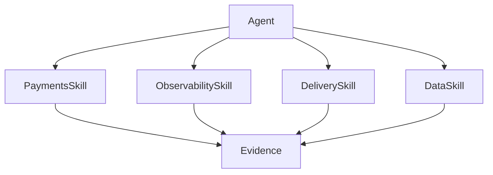

---

### 39. Too much fragmentation is also a problem

**The right boundary groups knowledge that changes and is used together**

Visual: show:

- Too large: context monolith
- Too small: dozens of tiny skills
- Balanced: a few meaningful contexts

---

### 40. Skills need ownership

**If everyone owns a skill, no one maintains it**

Visual: metadata example:

```yaml
name: payments-context
owner: payments-team
review_frequency: quarterly
sources:
  - payment-service
  - payment-documentation
  - payment-dashboards
```

---

## Part 5 — Agents, tools, MCP, and safety

### 41. The agent system has layers

**Agents, skills, tools, and MCP have different roles**

Visual:

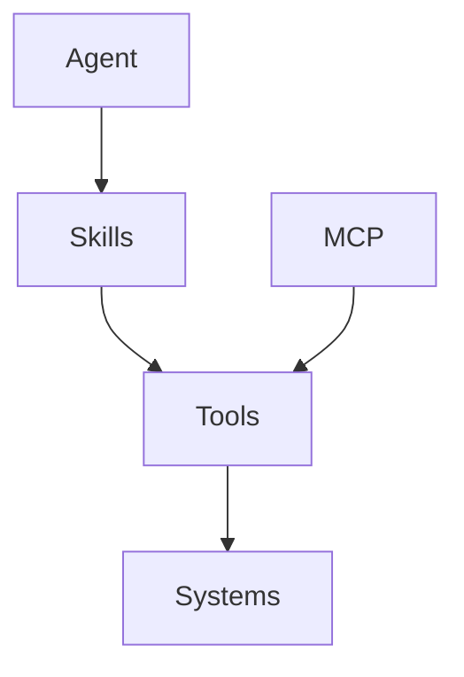

Source: [Article 7](https://luizschons.com/agents-skills-tools-and-mcp-how-these-pieces-fit-together)

---

### 42. What is an agent?

**An agent is a system that can reason, choose actions, and use tools**

Visual: loop:

```text
Goal → Reason → Tool call → Observe result → Continue
```

---

### 43. What is a tool?

**A tool performs an action or retrieves information**

Examples:

- Query logs
- Read a dashboard
- Search a repository
- Create a pull request
- Open an incident

Visual: agent connected to a tool interface.

---

### 44. A tool is not a skill

**A tool provides capability**

**A skill provides context and guidance**

Visual: hammer versus instruction manual, or tool versus operating procedure.

---

### 45. What is MCP?

**MCP standardizes how agents discover and use external capabilities**

Visual: agent connected to multiple MCP servers, each exposing tools and resources.

---

### 46. The harness around the agent

**The agent needs an environment with limits**

Visual: outer boundary containing:

- Identity
- Permissions
- Tools
- Policies
- Approvals
- Observability

---

### 47. Guardrails are enforced outside the prompt

**Prompts guide behavior**

**Protected resources enforce permissions**

Visual: request passing through layers:

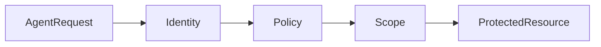

Source: [Article 5](https://luizschons.com/guardrails-and-fitness-functions-for-ai-friendly-architecture)

---

### 48. Deterministic fitness functions

**Architecture needs continuous, reproducible checks**

Visual: pull request passing through architecture tests.

Examples:

- Dependency rules
- Scope checks
- Static analysis
- Data access rules
- Required metadata

---

## Part 6 — From epic to production

### 49. AI-friendly delivery

**The agent can participate across the delivery lifecycle**

Diagram example:

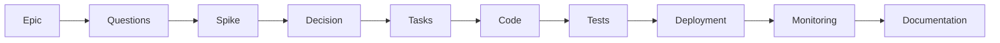

Source: [Article 8](https://luizschons.com/from-epic-to-production-using-agents-to-deliver-features-in-real-systems)

---

### 50. Closing

**AI-friendly architecture is context made explicit**

Final points:

- Systems need discoverable context
- Context needs structure and ownership
- Specialized skills reduce noise
- Tools expand capability
- Guardrails protect the system
- Humans remain accountable for important decisions

Closing sentence:

**The next evolution of software architecture is designing systems that humans and agents can understand together.**

Visual: human and AI agent collaborating around the same architecture map.

---

## Optional extended section — Agent observability and OpenTelemetry

The following slides can be added after slide 50 when the audience wants a more concrete technical example. They are based on [Agent Observability with OpenTelemetry](https://luizschons.com/agent-observability-with-opentelemetry).

### 51. The agent’s work also needs to be observable

**A successful answer is not enough**

We also need to understand:

- What the agent did
- Which context it used
- Which tools it called
- What evidence it found
- Where the process became uncertain

Visual: an agent session shown as a trace with multiple steps.

---

### 52. System observability and agent observability

**Two systems are producing signals**

Visual: two parallel lanes:

```text
Application signals: requests → services → databases → outcomes
Agent signals: session → reasoning steps → tool calls → decisions
```

Show how both lanes eventually connect to the same business outcome.

---

### 53. From activity to results

**Agent activity is only useful when connected to outcomes**

Visual: funnel:

```text
Agent session → Context retrieved → Tools used → Evidence → Decision → Outcome
```

Possible outcome examples:

- Incident resolved
- Pull request created
- Hypothesis rejected
- Human approval requested

---

### 54. What an agent trace should contain

**A useful trace preserves the path to the result**

Possible span hierarchy:

```text
agent.session
├── context.selection
├── skill.activation
├── tool.call
│   ├── repository.search
│   └── observability.query
├── evidence.synthesis
└── human.approval
```

Visual: expandable trace tree.

---

### 55. Context also appears in the metrics

**The context used by the agent is part of the explanation**

Useful attributes:

- `context.skill`
- `context.source`
- `context.version`
- `context.owner`
- `context.freshness`

Visual: a trace span annotated with context metadata.

---

### 56. Tool calls are first-class events

**Every tool call should be explainable**

Possible attributes:

- Tool name
- Target system
- Operation
- Read or write mode
- Request scope
- Result status
- Duration

Visual: one tool-call span with input and output metadata.

---

### 57. The `session_id` connection

**One identifier can connect the agent session to the system activity**

Visual: an agent session ID propagated through:

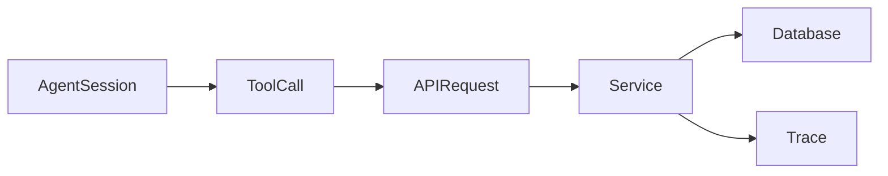

Show the same `session_id` or correlation identifier across the layers.

---

### 58. OpenTelemetry as a common layer

**A common telemetry model reduces fragmentation**

Visual: agents, tools, applications, and infrastructure producing signals into a shared OpenTelemetry pipeline.

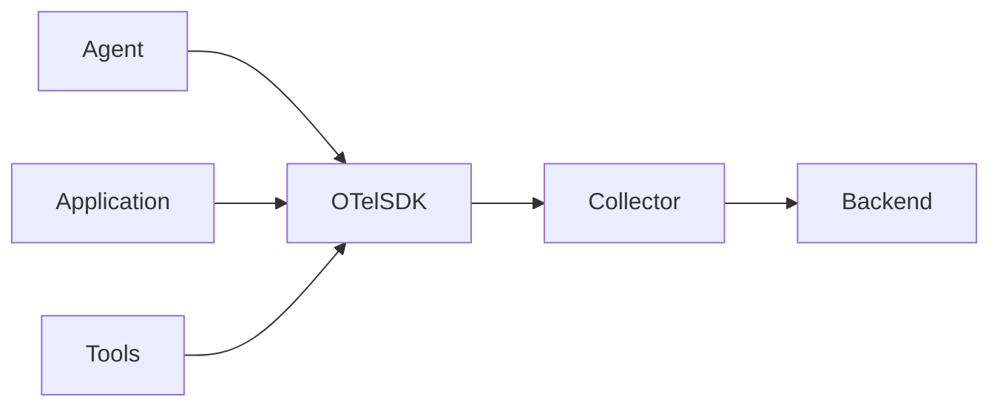

---

### 59. The OpenTelemetry pipeline

**Instrumentation → Collection → Export → Analysis**

Visual: four-stage pipeline:

1. Instrument the agent and application
2. Receive telemetry in the Collector
3. Export traces, metrics, and logs
4. Query and visualize the signals

---

### 60. Minimal instrumentation architecture

**Start with a small, useful signal set**

Visual: show the minimum viable components:

- Agent runtime
- OpenTelemetry SDK
- OpenTelemetry Collector
- Trace backend
- Dashboard or investigation interface

Avoid showing every possible OpenTelemetry component at once.

---

### 61. A simple agent span model

**Model the work as nested operations**

Example names:

```text
agent.run
agent.plan
agent.context.retrieve
agent.tool.execute
agent.observe
agent.finalize
```

Visual: nested spans aligned on a timeline.

---

### 62. What to measure first

**Start with signals that answer operational questions**

Measure:

- Total session duration
- Time spent in tools
- Number of tool calls
- Context retrieval latency
- Failed tool calls
- Human approval wait time
- Final outcome

Visual: prioritize a small set of metrics over a crowded dashboard.

---

### 63. Token usage and cost

**Cost is part of the agent’s operational behavior**

Possible measurements:

- Input tokens
- Output tokens
- Number of model calls
- Model selected
- Estimated cost
- Context size

Visual: a trace connected to a small cost summary.

---

### 64. Latency across the agent workflow

**The slowest step may not be the model**

Visual: waterfall showing time spent in:

- Context retrieval
- Model inference
- Tool calls
- External APIs
- Human approval

Key message:

**Agent latency is a system property.**

---

### 65. Failed tool calls are context signals

**Repeated failures often reveal a design problem**

Possible causes:

- Wrong tool selected
- Missing permission
- Ambiguous contract
- Stale skill instructions
- Incorrect resource scope

Visual: failed tool call branching into diagnosis categories.

---

### 66. Observability is also security

**Telemetry should make risky behavior visible**

Track:

- Unexpected tools
- Sensitive resource access
- Scope violations
- Repeated denied requests
- Unusual data volume
- Attempts to bypass approval

Visual: security signals highlighted on the same agent trace.

---

### 67. Privacy and telemetry boundaries

**Observability must not become a new data leak**

Visual: telemetry pipeline with explicit filtering before export.

Possible controls:

- Remove secrets
- Mask personal data
- Avoid raw prompts when unnecessary
- Restrict access to traces
- Define retention periods

---

### 68. A lab scenario

**A payment failure investigation**

Scenario:

1. The agent receives an alert
2. It activates the Payments Skill
3. It queries observability signals
4. It checks recent deployments
5. It forms a hypothesis
6. It requests human approval for a change

Visual: one complete trace connecting all six stages.

---

### 69. Reading the trace

**The trace should explain why the agent reached its conclusion**

Show a trace review with:

- Context selected
- Evidence retrieved
- Tools called
- Failed attempts
- Uncertainty
- Final recommendation

Visual: annotated trace with callouts.

---

### 70. The operational feedback loop

**Observability improves the architecture over time**

Diagram example:

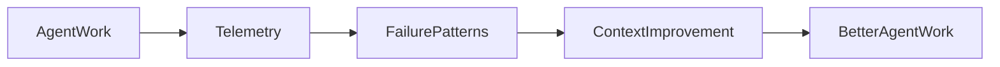

---

### 71. What to implement first

**A practical starting point**

Suggested sequence:

1. Create a session identifier
2. Trace tool calls
3. Record context and skill usage
4. Measure outcomes
5. Add security and privacy filters
6. Review recurring failures

Visual: staircase showing incremental adoption.

---

### 72. Bonus closing

**If we cannot observe the agent, we cannot improve the architecture**

Final message:

**Agent observability turns invisible reasoning into operational evidence.**

Visual: the original system map from slide 1, now enriched with an observable agent path.

---

## Extended timing options

### Compact version

Use slides 1–50 for approximately 45–50 minutes.

### Technical version

Use slides 1–50 plus selected slides 51–72 for approximately 60–75 minutes.

### Full workshop version

Use the complete deck and add a live exercise around slides 57, 68, and 69. This can support a 90-minute session.

## Suggested timing for the original narrative

- Slides 1–10: 8 minutes
- Slides 11–22: 11 minutes
- Slides 23–29: 6 minutes
- Slides 30–40: 10 minutes
- Slides 41–48: 9 minutes
- Slides 49–50: 5 minutes

Total: approximately 49 minutes.

## Source articles

1. [Is your software ready to be understood by an AI?](https://luizschons.com/seu-software-est-pronto-para-ser-entendido-por-uma-ia)
2. [Code Is Not Context: Designing a Context Architecture for Agents](https://luizschons.com/code-is-not-context-designing-a-context-architecture-for-agents)
3. [Observability Is Also Context for AI Agents](https://luizschons.com/observability-is-also-context-for-ai-agents)
4. [Skills: Specialized Context for AI Agents](https://luizschons.com/skills-specialized-context-for-ai-agents)
5. [Guardrails and Fitness Functions for AI-Friendly Architecture](https://luizschons.com/guardrails-and-fitness-functions-for-ai-friendly-architecture)
6. [Context Skills: Breaking Down the Context for AI Agents](https://luizschons.com/context-skills-breaking-down-the-context-for-ai-agents)
7. [Agents, Skills, Tools, and MCP: How These Pieces Fit Together](https://luizschons.com/agents-skills-tools-and-mcp-how-these-pieces-fit-together)
8. [From Epic to Production: Using Agents to Deliver Features in Real Systems](https://luizschons.com/from-epic-to-production-using-agents-to-deliver-features-in-real-systems)
9. [Agent Observability with OpenTelemetry](https://luizschons.com/agent-observability-with-opentelemetry)
