# Arquitetura de Software Amigável para IA

Guia slide a slide para criar a apresentação manualmente no Keynote ou Canva.

## Sistema visual

- 16:9, fundo branco.
- Texto preto, com um único azul discreto para setas ou destaques.
- Uma ideia por slide.
- Sempre que possível, um diagrama grande por slide.
- Sem imagens de banco, ilustrações, gradientes, texturas ou elementos decorativos.
- Use uma fonte sans-serif limpa.
- Título: 34–44 pt. Labels do diagrama: 22–30 pt. Rodapé pequeno: 12–14 pt.
- Mantenha os diagramas grandes e centralizados. Deixe bastante espaço em branco.
- O texto abaixo é o conteúdo visível do slide. O “Texto” é a explicação que deve aparecer no slide para apoiar a apresentação.

---

## Slide 1 — Arquitetura de Software Amigável para IA

**Título visível**

Arquitetura de Software Amigável para IA

**Subtítulo visível**

Da base de código a sistemas ricos em contexto

**Rodapé pequeno**

Luiz Schons

**Visual**

Não é necessário diagrama. Use uma linha horizontal muito fina abaixo do título.

**Texto**

Hoje não vamos falar apenas sobre adicionar uma funcionalidade de IA a um sistema existente. Vamos falar sobre projetar sistemas que pessoas e agentes de IA consigam entender e operar com segurança.

---

## Slide 2 — The question

**Título visível**

Um engenheiro ou agente de IA consegue entender o sistema rapidamente?

**Visual**

Place a large central circle labeled `SYSTEM`. Around it, place four boxes: `CODE`, `DOCS`, `RUNTIME`, `PEOPLE`. Connect each box to the circle.

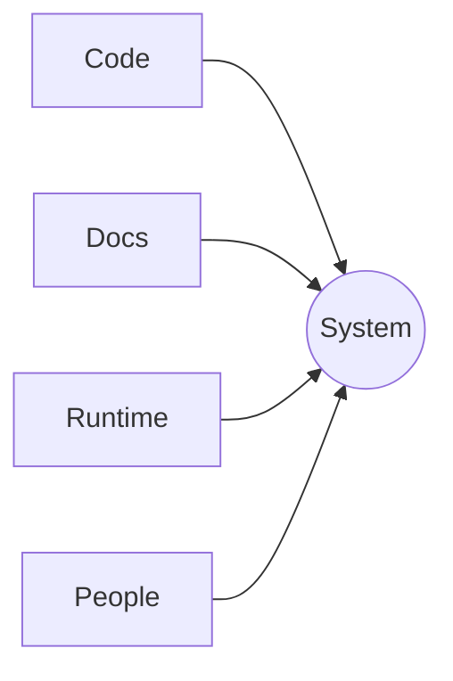

**Texto**

Essa pergunta vai guiar toda a apresentação. Entender um sistema exige mais do que ler o código-fonte.

---

## Slide 3 — Entrando em um sistema desconhecido

**Título visível**

Entrando em um sistema desconhecido

**Labels visíveis**

Repository · Tickets · Slack · Dashboards · Deployments · Tribal knowledge

**Visual**

Put `NEW ENGINEER` in the center. Arrange the six labels around it as large boxes.

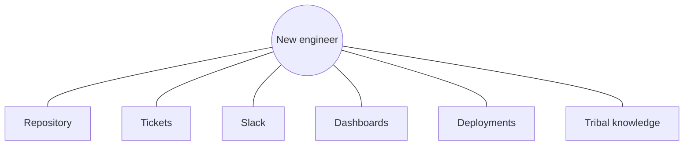

**Texto**

O primeiro dia geralmente é um problema de busca. O engenheiro não está apenas aprendendo código; está reconstruindo o contexto do sistema.

---

## Slide 4 — O repositório não é o sistema

**Título visível**

O repositório não é o sistema

**Visual**

Draw a small box labeled `REPOSITORY` inside a much larger boundary labeled `SYSTEM CONTEXT`. Inside the larger boundary, add `Decisions`, `Operations`, `Business rules`, and `Ownership`.

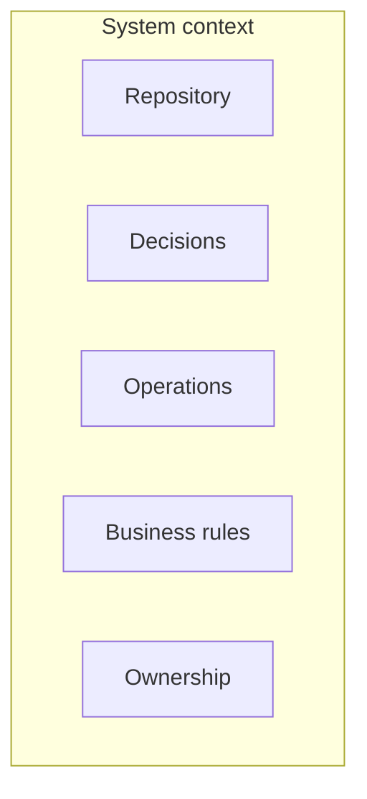

**Texto**

O repositório mostra o que o software faz. Raramente mostra toda a razão, o modelo de responsabilidade ou a realidade operacional por trás dele.

---

## Slide 5 — O agente é rápido. O contexto não é.

**Título visível**

O agente é rápido. O contexto não é.

**Visual**

Use a large four-step loop: `Retrieve → Interpret → Act → Verify`. Add a small break or warning label between `Retrieve` and `Interpret`: `Missing context`.

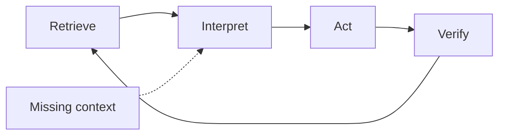

**Texto**

Um agente pode executar rapidamente, mas sua qualidade é limitada pela qualidade e pela disponibilidade do contexto que consegue recuperar.

---

## Slide 6 — O que está faltando?

**Título visível**

O que está faltando?

**Visual**

Three large horizontal boxes: `MODEL`, `PROMPT`, `CONTEXT`. Give `CONTEXT` a blue outline.

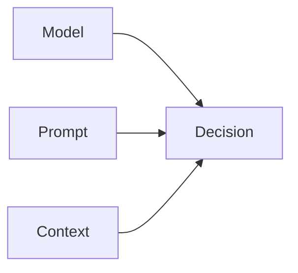

**Texto**

Muitas vezes tentamos resolver cada falha mudando o modelo ou o prompt. Em muitos sistemas reais, o ingrediente que falta é contexto.

---

## Slide 7 — O código é apenas uma camada

**Título visível**

O código é apenas uma camada

**Visual**

Create a six-layer vertical stack. Use only these labels:

`Code` / `Tests` / `Decisions` / `Business rules` / `Runtime` / `Ownership`

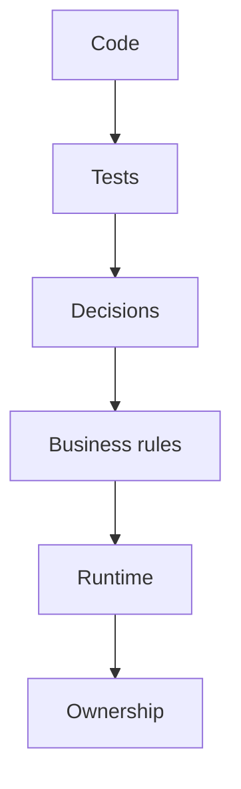

**Texto**

Uma arquitetura amigável para IA torna essas camadas mais fáceis de descobrir e conectar. Ela não trata a base de código como a única fonte da verdade.

---

## Slide 8 — Informação se transforma em contexto

**Título visível**

Informação se transforma em contexto

**Visual**

Split the slide in two. Left: disconnected dots labeled `facts`. Right: one `DECISION` connected to `facts`, `OWNER`, and `EVIDENCE`.

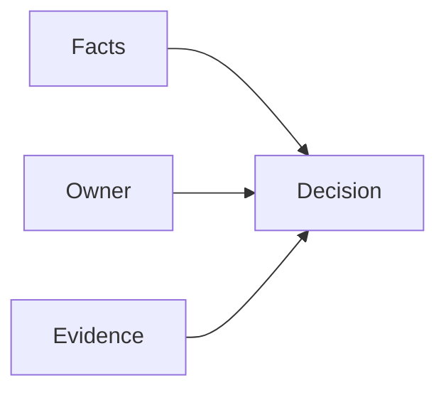

**Texto**

Fatos se tornam contexto útil quando estão conectados a decisões, responsabilidades, intenção e evidências.

---

## Slide 9 — Context Architecture

**Título visível**

Context Architecture

**Subtítulo visível**

Designing how relevant knowledge becomes discoverable.

**Visual**

No diagram. Use one thin blue horizontal line.

**Texto**

Agora passamos do problema para a resposta arquitetural: projetar o contexto de forma intencional.

---

## Slide 10 — O contexto começa com perguntas

**Título visível**

O contexto começa com perguntas

**Visual**

Central box: `DECISION`. Four surrounding boxes: `What is true?`, `Who owns it?`, `Why this way?`, `How verify?`.

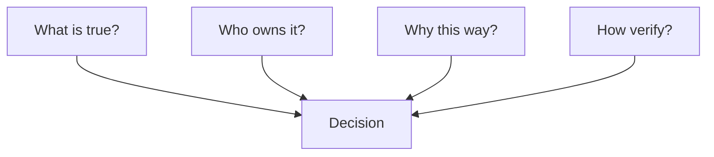

**Texto**

Não comece coletando tudo. Comece identificando as perguntas que pessoas e agentes precisam responder repetidamente.

---

## Slide 11 — O contexto é distribuído

**Título visível**

O contexto é distribuído

**Visual**

Create one large horizontal connected map:

`Repository → Docs → Tickets → People → Runtime`

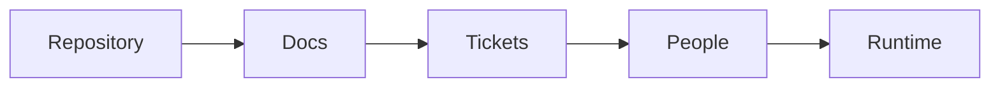

**Texto**

O objetivo não é necessariamente colocar tudo em um banco de dados. O objetivo é tornar descobrível o caminho relevante através do contexto distribuído.

---

## Slide 12 — Exemplo: pagamentos

**Título visível**

Exemplo: pagamentos

**Visual**

Use a four-step horizontal flow:

`Authorize → Capture → Confirm → Reconcile`

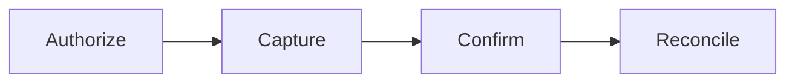

**Texto**

Um pagamento não é uma única operação. Cada etapa tem regras, responsáveis, evidências e modos de falha diferentes.

---

## Slide 13 — Torne óbvia a próxima fonte

**Título visível**

Torne óbvia a próxima fonte

**Visual**

Left: `QUESTION`. Center: `INDEX`. Right: three sources: `Source of truth`, `Owner`, `Evidence`.

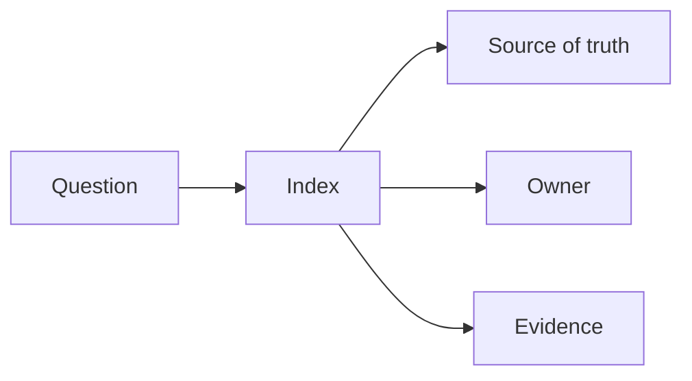

**Texto**

Uma boa arquitetura de contexto reduz a incerteza da busca. Ela indica ao usuário ou ao agente onde procurar em seguida.

---

## Slide 14 — Responsabilidade e histórico de decisões

**Título visível**

Responsabilidade e histórico de decisões

**Visual**

Use a timeline with four nodes:

`Decision → Rationale → Owner → Current status`

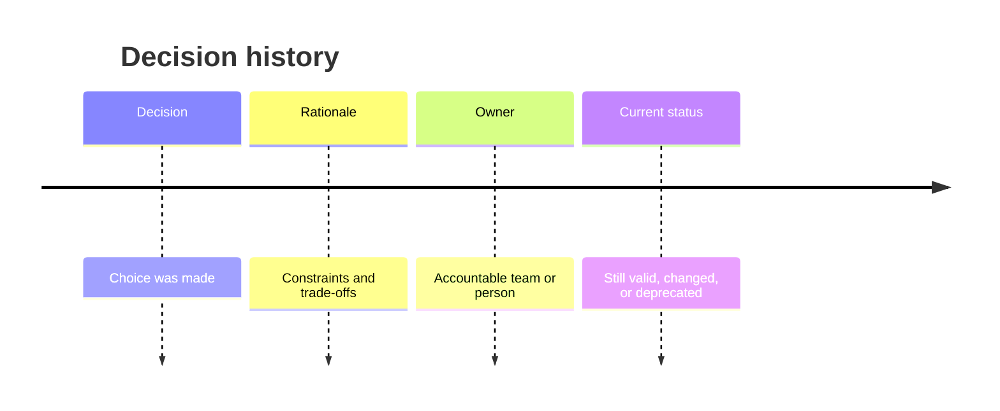

**Texto**

Sem justificativa e responsabilidade, cada pessoa ou agente novo precisa redescobrir a mesma decisão.

---

## Slide 15 — O contexto acompanha o fluxo de trabalho

**Título visível**

O contexto acompanha o fluxo de trabalho

**Visual**

Use a circular flow:

`Question → Evidence → Decision → Change → Observation → Updated context`

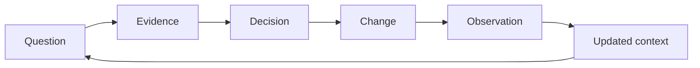

**Texto**

O contexto deve evoluir com o sistema. Ele faz parte do fluxo de trabalho, não é um documento escrito uma vez e esquecido.

---

## Slide 16 — O teste da pessoa nova

**Título visível**

O teste da pessoa nova

**Visible statement**

Can someone unfamiliar find the answer?

**Visual**

One large arrow:

`Question → Discoverable answer`

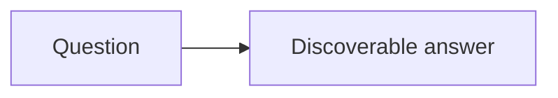

**Texto**

Este é um teste prático para cada parte importante do contexto. Se a resposta existe apenas na memória de alguém, a arquitetura está incompleta.

---

## Slide 17 — Produção também é contexto

**Título visível**

Produção também é contexto

**Visual**

Use a five-step lifecycle:

`Design → Code → Deploy → Run → Learn`

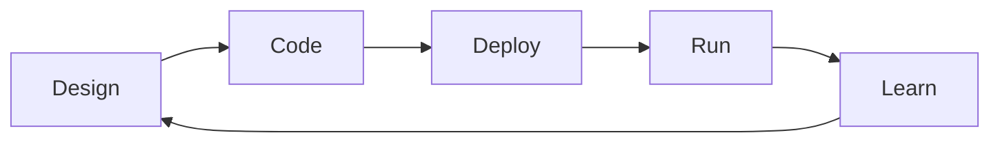

**Texto**

Uma decisão de design não pode ser completamente entendida sem observar como o sistema se comporta depois do deploy.

---

## Slide 18 — Observabilidade como contexto

**Título visível**

Observabilidade como contexto

**Visual**

Three inputs flow into one box:

`Logs + Metrics + Traces → Evidence`

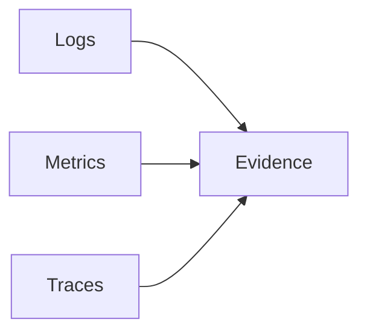

**Texto**

Observabilidade não serve apenas para dashboards. Ela fornece evidências que ajudam pessoas e agentes a explicar o que está acontecendo.

---

## Slide 19 — Sem contexto, investigar vira adivinhação

**Título visível**

Sem contexto, investigar vira adivinhação

**Visual**

Left box: `Noise`. Right box: `Decision`. Put a broken or dotted arrow between them. Underneath, add a second path: `Evidence → Explanation → Decision`.

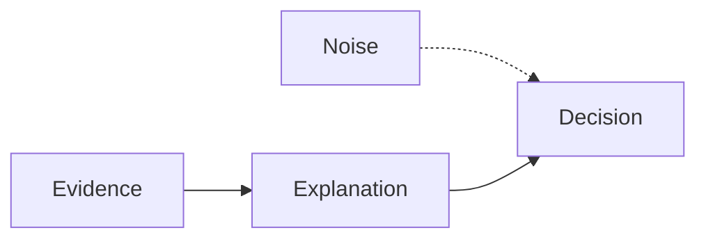

**Texto**

Dados sem relacionamentos criam ruído. O contexto transforma sinais operacionais em uma explicação e em uma decisão segura.

---

## Slide 20 — Investigação orientada por evidências

**Título visível**

Investigação orientada por evidências

**Visual**

Large five-step flow:

`Detect → Correlate → Explain → Decide → Verify`

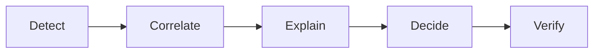

**Texto**

Esta é a versão operacional do contexto: as evidências devem conectar o sinal inicial a uma ação verificada.

---

## Slide 21 — O agente precisa de contexto operacional

**Título visível**

O agente precisa de contexto operacional

**Visual**

Center: `AGENT`. Around it: `Code`, `Docs`, `Logs`, `Metrics`, `Traces`.

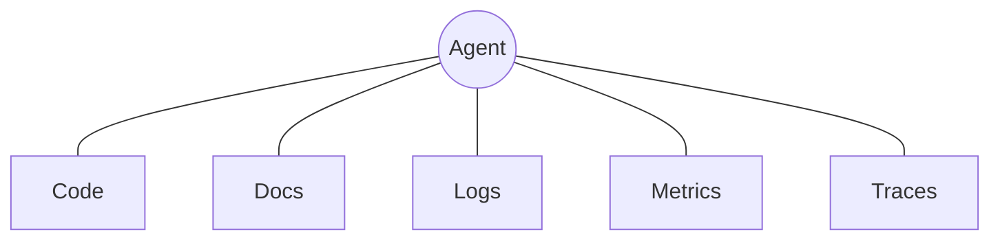

**Texto**

Um agente que consegue ler código, mas não consegue ver evidências de execução, ainda não conhece uma parte importante do sistema.

---

## Slide 22 — O monólito de contexto

**Título visível**

O monólito de contexto

**Visual**

One oversized box labeled `EVERYTHING`. Around it, three small labels: `Stale`, `Noisy`, `Ambiguous`.

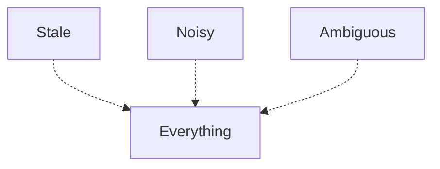

**Texto**

Colocar toda informação possível em um prompt gigante ou em uma única fonte de conhecimento não cria contexto útil automaticamente.

---

## Slide 23 — Decomponha em torno das decisões

**Título visível**

Decomponha em torno das decisões

**Visual**

Show a transformation from one box `Everything` into three boxes: `Investigate`, `Change`, `Verify`.

```mermaid
flowchart LR
  E[Everything] --> I[Investigate]
  E --> C[Change]
  E --> V[Verify]
```

**Texto**

Decomponha o contexto em torno das decisões e dos fluxos de trabalho que usuários e agentes realmente precisam executar.

---

## Slide 24 — Context Skills

**Título visível**

Context Skills

**Subtítulo visível**

Small, bounded capabilities for useful context and safe action.

**Visual**

No diagram. Use one thin blue horizontal line.

**Texto**

O próximo passo é empacotar o contexto em capacidades compreensíveis e seguras de usar.

---

## Slide 25 — Context Skill vs. Microservice

**Título visível**

Context Skill vs. Microservice

**Visual**

Two columns with only three rows:

| | Microservice | Context Skill |
|---|---|---|
| Goal | Runtime boundary | Discoverable capability |
| Boundary | Service ownership | Safe interaction |
| User | Application | Human or agent |

**Texto**

Uma Context Skill não é simplesmente um novo nome para um microsserviço. Ela é moldada por descobribilidade, significado e interação segura.

---

## Slide 26 — Context Skill de pagamentos

**Título visível**

Context Skill de pagamentos

**Visual**

Draw one boundary box labeled `PAYMENTS SKILL`. Inside it, place four boxes:

`Status`, `History`, `Evidence`, `Safe actions`

```mermaid
flowchart TB
  subgraph P[Payments Skill]
    S[Status]
    H[History]
    E[Evidence]
    A[Safe actions]
  end
```

**Texto**

A skill expõe uma capacidade coerente, não uma coleção aleatória de APIs de pagamento.

---

## Slide 27 — Skills têm limites

**Título visível**

Skills têm limites

**Visual**

Four quadrants around a central box `SKILL`:

`Allowed actions`, `Required evidence`, `Refuse when`, `Escalate to`.

```mermaid
flowchart TB
  A[Allowed actions] --> S[Skill]
  E[Required evidence] --> S
  R[Refuse when] --> S
  X[Escalate to] --> S
```

**Texto**

Uma capacidade é mais segura quando seus limites são explícitos. A skill deve saber o que pode fazer, quando precisa recusar e para onde escalar.

---

## Slide 28 — Um agente, muitas skills

**Título visível**

Um agente, muitas skills

**Visual**

Center: `AGENT`. Four surrounding boxes: `Payments`, `Identity`, `Orders`, `Observability`.

```mermaid
flowchart TB
  A((Agent))
  A --- P[Payments]
  A --- I[Identity]
  A --- O[Orders]
  A --- V[Observability]
```

**Texto**

O agente não precisa de uma capacidade enorme. Ele pode coordenar várias skills delimitadas, com responsabilidades e contratos claros.

---

## Slide 29 — Responsabilidade torna a decomposição útil

**Título visível**

Responsabilidade torna a decomposição útil

**Visual**

Four connected boxes:

`Context → Owner → Source of truth → Verification`

```mermaid
flowchart LR
  C[Context] --> O[Owner] --> S[Source of truth] --> V[Verification]
```

**Texto**

A decomposição só ajuda quando cada parte tem alguém responsável, uma fonte autorizada e uma forma de verificação.

---

## Slide 30 — O sistema de agentes tem camadas

**Título visível**

O sistema de agentes tem camadas

**Visual**

Use a clean six-layer stack:

`Model` / `Orchestrator` / `Skills` / `Context` / `Systems` / `Telemetry`

```mermaid
flowchart TB
  M[Model]
  O[Orchestrator]
  S[Skills]
  C[Context]
  Y[Systems]
  T[Telemetry]
  M --> O --> S --> C --> Y
  Y --> T
```

**Texto**

A arquitetura de IA não é apenas o modelo. Ela inclui orquestração, capacidades, contexto, sistemas de registro e telemetria.

---

## Slide 31 — O loop do agente

**Título visível**

O loop do agente

**Visual**

Large circular loop:

`Observe → Retrieve → Reason → Act → Verify`

```mermaid
flowchart LR
  O[Observe] --> R[Retrieve] --> T[Reason] --> A[Act] --> V[Verify] --> O
```

**Texto**

O importante não é apenas agir. O loop precisa observar e verificar para que o sistema aprenda com o que aconteceu.

---

## Slide 32 — Ferramentas são capacidades. Skills dão significado.

**Título visível**

Ferramentas são capacidades. Skills dão significado.

**Visual**

Left box: `RAW TOOL`. Right box: `BOUNDED SKILL`. Connect them with an arrow labeled `context + rules`.

```mermaid
flowchart LR
  T[Raw tool] -->|context + rules| S[Bounded skill]
```

**Texto**

Uma ferramenta bruta expõe uma operação. Uma skill explica quando usá-la, quais evidências são necessárias e o que significa usá-la com segurança.

---

## Slide 33 — MCP e o harness

**Título visível**

MCP e o harness

**Visual**

Draw a large boundary labeled `HARNESS`. Inside: `Model`, `Tools`, `Skills`, `Policies`, `Telemetry`.

```mermaid
flowchart TB
  subgraph H[Harness]
    M[Model]
    T[Tools]
    S[Skills]
    P[Policies]
    O[Telemetry]
  end
```

**Texto**

O modelo é um componente dentro de um ambiente de execução maior. O harness fornece capacidades, limites e visibilidade.

---

## Slide 34 — Guardrails são arquitetura

**Título visível**

Guardrails são arquitetura

**Visual**

Action pipeline with three checkpoints:

`Before action → During action → After action`

```mermaid
flowchart LR
  B[Before action] --> A[Action] --> D[During action] --> V[After action]
```

**Texto**

Segurança não pode ser adicionada apenas em uma tela de aprovação final. Ela pertence aos momentos antes, durante e depois da execução.

---

## Slide 35 — Fitness functions

**Título visível**

Fitness functions

**Visual**

Put `AI-FRIENDLY` in the center. Around it, six labels:

`Discoverable`, `Fresh`, `Owned`, `Evidenced`, `Safe`, `Traceable`.

```mermaid
flowchart TB
  D[Discoverable] --> A[AI-friendly]
  F[Fresh] --> A
  O[Owned] --> A
  E[Evidenced] --> A
  S[Safe] --> A
  T[Traceable] --> A
```

**Texto**

Essas propriedades podem se tornar verificações arquiteturais. Elas ajudam as equipes a avaliar se o sistema está ficando mais fácil de usar com responsabilidade por pessoas e agentes.

---

## Slide 36 — Testes antes dos prompts

**Título visível**

Testes antes dos prompts

**Visual**

```mermaid
flowchart LR
  T[Tests first] --> A[AI-assisted implementation] --> V[Deterministic validation]
```

**Texto**

Antes de pedir a um agente de IA para alterar o sistema, precisamos de verificações determinísticas que definam o que significa “funcionar”. Testes fornecem um loop de feedback estável. Prompts podem variar. Testes não deveriam variar.

---

## Slide 37 — Testes são o contrato

**Título visível**

Testes são o contrato

**Visual**

```mermaid
flowchart TB
  H[Human implementation] --> T[Tests]
  A[AI implementation] --> T
  R[Refactoring] --> T
  T --> O[Expected behavior]
```

**Texto**

A implementação pode vir de uma pessoa, de um agente de IA ou de uma refatoração. O contrato continua o mesmo: o sistema precisa produzir o comportamento esperado.

---

## Slide 38 — A IA precisa de um oráculo determinístico

**Título visível**

A IA precisa de um oráculo determinístico

**Visual**

```mermaid
flowchart LR
  P[Prompt] --> X[Probabilistic change]
  X --> Q[Uncertain result]
  T[Test] --> Y[Deterministic check]
  Y --> Z[Observable result]
```

**Texto**

Um prompt não é um critério de aceite confiável. Ele é uma instrução para produzir uma mudança. Um teste é uma expectativa executável que pode dizer se a mudança é aceitável.

---

## Slide 39 — Ciclo de entrega

**Título visível**

Ciclo de entrega

**Visual**

Use a loop:

`Map context → Expose skill → Instrument → Evaluate → Improve`

```mermaid
flowchart LR
  M[Map context] --> S[Expose skill] --> I[Instrument] --> E[Evaluate] --> U[Improve] --> M
```

**Texto**

A entrega amigável para IA começa com feedback determinístico. Quando os testes definem o comportamento esperado, as equipes podem usar agentes para acelerar implementação, avaliação e melhoria.

---

## Slide 40 — A revisão humana continua fazendo parte do sistema

**Título visível**

A revisão humana continua fazendo parte do sistema

**Visual**

Four-step flow:

`Agent proposes → Evidence supports → Human approves → System records`

```mermaid
flowchart LR
  A[Agent proposes] --> E[Evidence supports] --> H[Human approves] --> R[System records]
```

**Texto**

A revisão humana não é necessariamente uma falha da automação. É um ponto de controle intencional para decisões que exigem responsabilidade.

---

## Slide 41 — Observe o agente

**Título visível**

Observe o agente

**Visual**

Draw one long horizontal trace with six spans:

`Request | Reasoning | Tool | Skill | Change | Runtime`

```mermaid
gantt
  title Agent trace
  dateFormat X
  axisFormat %s
  section Trace
  Request   :a1, 0, 1
  Reasoning :a2, 1, 2
  Tool      :a3, 2, 3
  Skill     :a4, 3, 5
  Change    :a5, 5, 6
  Runtime   :a6, 6, 8
```

**Texto**

A observabilidade deve cobrir o comportamento do agente, não apenas o serviço que finalmente recebe a solicitação.

---

## Slide 42 — Comece com uma skill

**Título visível**

Comece com uma skill

**Visual**

Three large numbered steps:

`01 Map critical context` → `02 Expose one skill` → `03 Learn from signals`

```mermaid
flowchart LR
  A[01 Map critical context] --> B[02 Expose one skill] --> C[03 Learn from signals]
```

**Texto**

Não comece reescrevendo a plataforma. Escolha um fluxo de trabalho valioso, mapeie seu contexto, exponha uma skill delimitada e aprenda com o uso real.

---

## Slide 43 — Conclusão

**Título visível**

AI-friendly architecture is context made intentional.

**Subtítulo visível**

Discoverable. Bounded. Observable. Verifiable.

**Visual**

No diagram. Use four words spaced widely across the bottom of the slide.

**Texto**

A ideia principal é simples: uma arquitetura amigável para IA não trata principalmente de tornar o modelo mais inteligente. Trata de tornar o conhecimento do sistema intencional, acessível, delimitado, observável e verificável.

---

## Optional bonus slides

These can be added after slide 40 if the talk needs more depth.

### Bonus 1 — OpenTelemetry as the evidence layer

**Título visível**

OpenTelemetry as the evidence layer

**Visual**

`Application → Instrumentation → Collector → Backend`

```mermaid
flowchart LR
  A[Application] --> I[Instrumentation] --> C[Collector] --> B[Backend]
```

**Texto**

O OpenTelemetry pode fornecer um caminho padrão para transformar o comportamento em execução em contexto que pessoas e agentes consigam inspecionar.

### Bonus 2 — Traces connect the story

**Título visível**

Traces connect the story

**Visual**

`User request → Agent → Tool → Service → Database`

```mermaid
flowchart LR
  U[User request] --> A[Agent] --> T[Tool] --> S[Service] --> D[Database]
```

**Texto**

O valor do tracing não está no número de spans. Está na capacidade de conectar uma decisão ao comportamento que ela produziu no sistema.

### Bonus 3 — The practical checklist

**Título visível**

Is this context ready?

**Labels visíveis**

Discoverable? Owned? Fresh? Evidenced? Safe to act on?

**Visual**

Five boxes connected to one central box labeled `READY`.

```mermaid
flowchart TB
  D[Discoverable] --> R[Ready]
  O[Owned] --> R
  F[Fresh] --> R
  E[Evidenced] --> R
  S[Safe] --> R
```
