# Building AI-Friendly Software Architecture

Manual slide-by-slide guide for creating the deck by hand in Keynote or Canva.

## Visual system

- 16:9, white background.
- Black text, one restrained blue accent for arrows or emphasis.
- One idea per slide.
- One large diagram per slide whenever possible.
- No stock images, illustrations, gradients, textures, or decorative visuals.
- Use a clean sans-serif typeface.
- Title: 34–44 pt. Diagram labels: 22–30 pt. Small footer: 12–14 pt.
- Keep diagrams centered and large. Leave generous whitespace.
- The text below is the visible slide copy. The “Speaker note” is what you explain verbally.

---

## Slide 1 — Building AI-Friendly Software Architecture

**Visible title**

Building AI-Friendly Software Architecture

**Visible subtitle**

From codebases to context-rich systems

**Small footer**

Luiz Schons

**Visual**

No diagram required. Use a very thin horizontal line under the title.

**Speaker note**

Today is not about adding an AI feature to an existing system. It is about designing systems that humans and AI agents can understand and operate safely.

---

## Slide 2 — The question

**Visible title**

Can an engineer or AI agent understand the system quickly?

**Visual**

Place a large central circle labeled `SYSTEM`. Around it, place four boxes: `CODE`, `DOCS`, `RUNTIME`, `PEOPLE`. Connect each box to the circle.

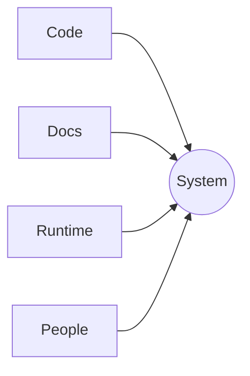

**Speaker note**

This question will guide the entire presentation. Understanding a system requires more than reading source code.

---

## Slide 3 — Entering an unfamiliar system

**Visible title**

Entering an unfamiliar system

**Visible labels**

Repository · Tickets · Slack · Dashboards · Deployments · Tribal knowledge

**Visual**

Put `NEW ENGINEER` in the center. Arrange the six labels around it as large boxes.

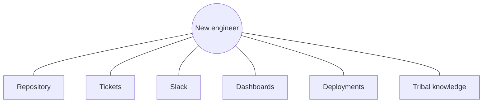

**Speaker note**

The first day is usually a search problem. The engineer is not only learning code; they are reconstructing the system’s context.

---

## Slide 4 — The repository is not the system

**Visible title**

The repository is not the system

**Visual**

Draw a small box labeled `REPOSITORY` inside a much larger boundary labeled `SYSTEM CONTEXT`. Inside the larger boundary, add `Decisions`, `Operations`, `Business rules`, and `Ownership`.

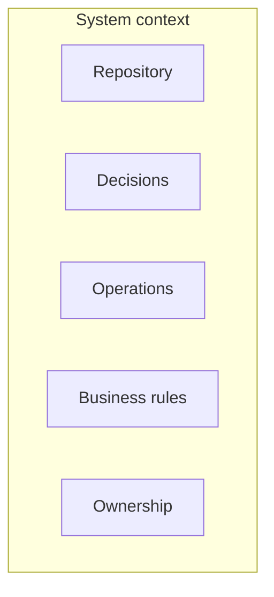

**Speaker note**

The repository tells us what the software does. It rarely tells us the complete reason, ownership model, or operational reality behind it.

---

## Slide 5 — The agent is fast. The context is not.

**Visible title**

The agent is fast. The context is not.

**Visual**

Use a large four-step loop: `Retrieve → Interpret → Act → Verify`. Add a small break or warning label between `Retrieve` and `Interpret`: `Missing context`.

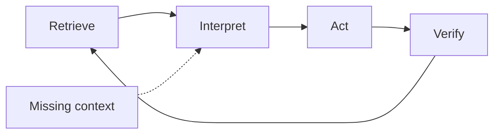

**Speaker note**

An agent can execute quickly, but its quality is constrained by the quality and availability of the context it can retrieve.

---

## Slide 6 — What is missing?

**Visible title**

What is missing?

**Visual**

Three large horizontal boxes: `MODEL`, `PROMPT`, `CONTEXT`. Give `CONTEXT` a blue outline.

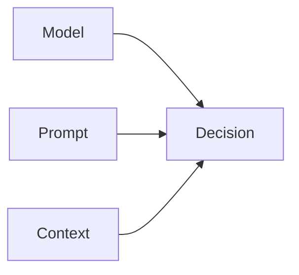

**Speaker note**

We often try to solve every failure by changing the model or prompt. In many real systems, the missing ingredient is context.

---

## Slide 7 — Code is one layer

**Visible title**

Code is one layer

**Visual**

Create a six-layer vertical stack. Use only these labels:

`Code` / `Tests` / `Decisions` / `Business rules` / `Runtime` / `Ownership`

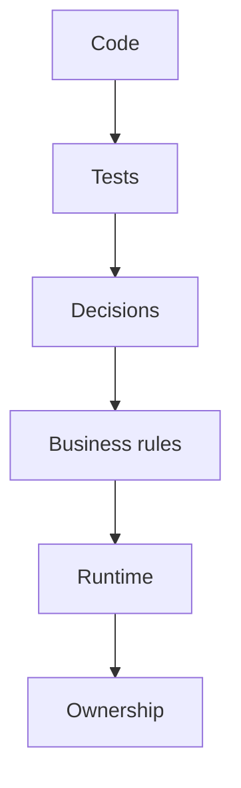

**Speaker note**

AI-friendly architecture makes these layers easier to discover and connect. It does not treat the codebase as the only source of truth.

---

## Slide 8 — Information becomes context

**Visible title**

Information becomes context

**Visual**

Split the slide in two. Left: disconnected dots labeled `facts`. Right: one `DECISION` connected to `facts`, `OWNER`, and `EVIDENCE`.

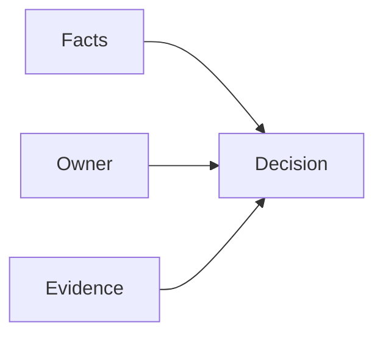

**Speaker note**

Facts become useful context when they are connected to decisions, ownership, intent, and evidence.

---

## Slide 9 — Context Architecture

**Visible title**

Context Architecture

**Visible subtitle**

Designing how relevant knowledge becomes discoverable.

**Visual**

No diagram. Use one thin blue horizontal line.

**Speaker note**

Now we move from the problem to the architectural response: designing context intentionally.

---

## Slide 10 — Context starts with questions

**Visible title**

Context starts with questions

**Visual**

Central box: `DECISION`. Four surrounding boxes: `What is true?`, `Who owns it?`, `Why this way?`, `How verify?`.

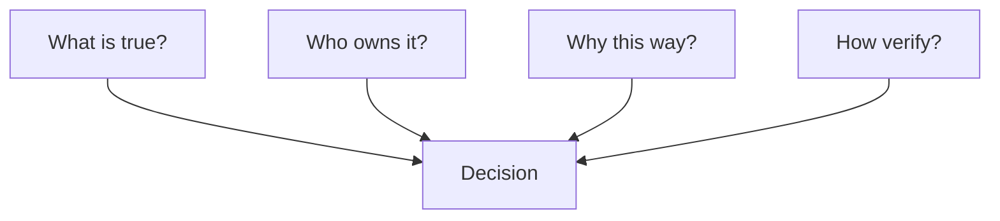

**Speaker note**

Do not begin by collecting everything. Begin by identifying the questions that people and agents repeatedly need to answer.

---

## Slide 11 — Context is distributed

**Visible title**

Context is distributed

**Visual**

Create one large horizontal connected map:

`Repository → Docs → Tickets → People → Runtime`

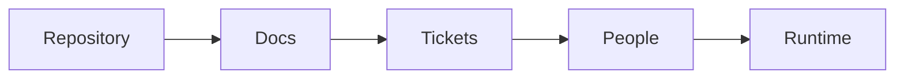

**Speaker note**

The goal is not necessarily to put everything in one database. The goal is to make the relevant path through the distributed context discoverable.

---

## Slide 12 — Example: payments

**Visible title**

Example: payments

**Visual**

Use a four-step horizontal flow:

`Authorize → Capture → Confirm → Reconcile`

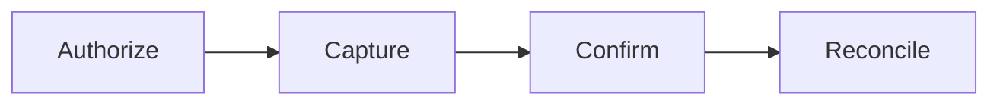

**Speaker note**

A payment is not one operation. Each stage has different rules, owners, evidence, and failure modes.

---

## Slide 13 — Make the next source obvious

**Visible title**

Make the next source obvious

**Visual**

Left: `QUESTION`. Center: `INDEX`. Right: three sources: `Source of truth`, `Owner`, `Evidence`.

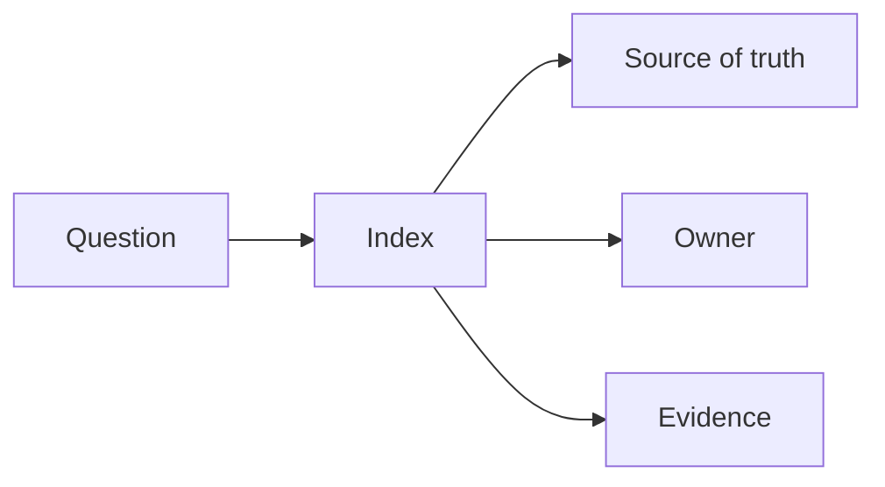

**Speaker note**

A good context architecture reduces search uncertainty. It tells the user or agent where to look next.

---

## Slide 14 — Ownership and decision history

**Visible title**

Ownership and decision history

**Visual**

Use a timeline with four nodes:

`Decision → Rationale → Owner → Current status`

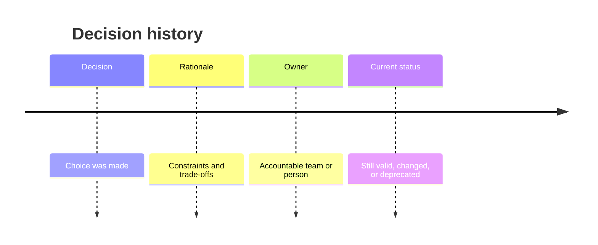

**Speaker note**

Without rationale and ownership, every new person or agent has to rediscover the same decision.

---

## Slide 15 — Context follows the workflow

**Visible title**

Context follows the workflow

**Visual**

Use a circular flow:

`Question → Evidence → Decision → Change → Observation → Updated context`

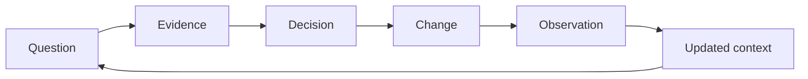

**Speaker note**

Context should evolve with the system. It is part of the workflow, not a document written once and forgotten.

---

## Slide 16 — The new-person test

**Visible title**

The new-person test

**Visible statement**

Can someone unfamiliar find the answer?

**Visual**

One large arrow:

`Question → Discoverable answer`

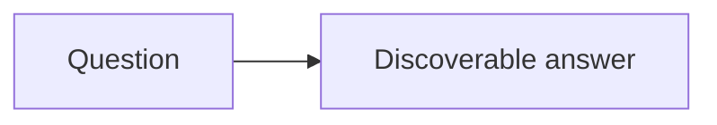

**Speaker note**

This is a practical test for every important piece of context. If the answer exists only in someone’s memory, the architecture is incomplete.

---

## Slide 17 — Production is context

**Visible title**

Production is context

**Visual**

Use a five-step lifecycle:

`Design → Code → Deploy → Run → Learn`

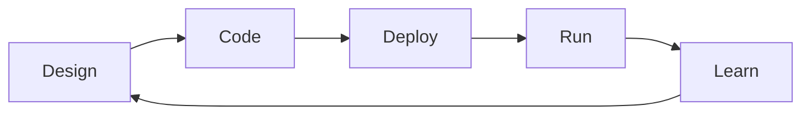

**Speaker note**

A design decision cannot be understood completely without seeing how the system behaves after deployment.

---

## Slide 18 — Observability as context

**Visible title**

Observability as context

**Visual**

Three inputs flow into one box:

`Logs + Metrics + Traces → Evidence`

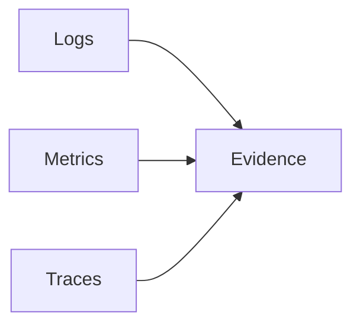

**Speaker note**

Observability is not only for dashboards. It provides evidence that helps humans and agents explain what is happening.

---

## Slide 19 — Without context, investigation becomes guessing

**Visible title**

Without context, investigation becomes guessing

**Visual**

Left box: `Noise`. Right box: `Decision`. Put a broken or dotted arrow between them. Underneath, add a second path: `Evidence → Explanation → Decision`.

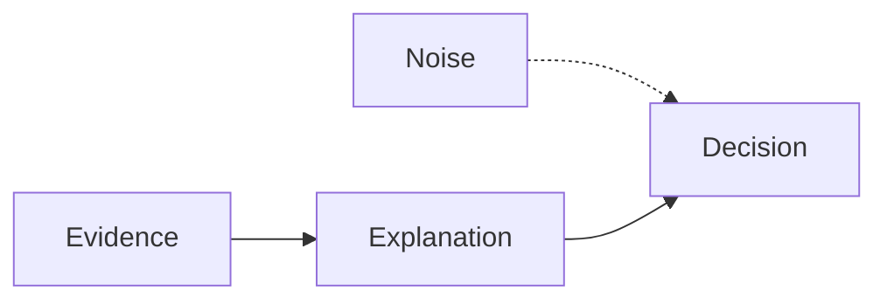

**Speaker note**

Data without relationships creates noise. Context turns operational signals into an explanation and a safe decision.

---

## Slide 20 — Evidence-driven investigation

**Visible title**

Evidence-driven investigation

**Visual**

Large five-step flow:

`Detect → Correlate → Explain → Decide → Verify`

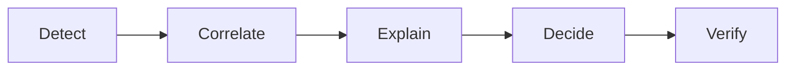

**Speaker note**

This is the operational version of context: evidence should support a complete path from signal to verified action.

---

## Slide 21 — The agent needs operational context

**Visible title**

The agent needs operational context

**Visual**

Center: `AGENT`. Around it: `Code`, `Docs`, `Logs`, `Metrics`, `Traces`.

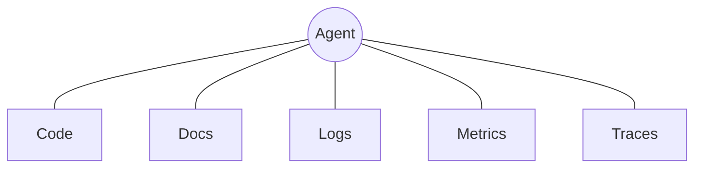

**Speaker note**

An agent that can read code but cannot see runtime evidence is still missing a major part of the system.

---

## Slide 22 — The context monolith

**Visible title**

The context monolith

**Visual**

One oversized box labeled `EVERYTHING`. Around it, three small labels: `Stale`, `Noisy`, `Ambiguous`.

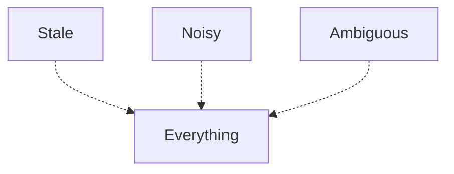

**Speaker note**

Putting every possible piece of information into one giant prompt or knowledge source does not automatically create useful context.

---

## Slide 23 — Decompose around decisions

**Visible title**

Decompose around decisions

**Visual**

Show a transformation from one box `Everything` into three boxes: `Investigate`, `Change`, `Verify`.

```mermaid
flowchart LR
  E[Everything] --> I[Investigate]
  E --> C[Change]
  E --> V[Verify]
```

**Speaker note**

Decompose context around the decisions and workflows that users and agents actually need to perform.

---

## Slide 24 — Context Skills

**Visible title**

Context Skills

**Visible subtitle**

Small, bounded capabilities for useful context and safe action.

**Visual**

No diagram. Use one thin blue horizontal line.

**Speaker note**

The next step is to package context into capabilities that are understandable and safe to use.

---

## Slide 25 — Context Skill vs. Microservice

**Visible title**

Context Skill vs. Microservice

**Visual**

Two columns with only three rows:

| | Microservice | Context Skill |
|---|---|---|
| Goal | Runtime boundary | Discoverable capability |
| Boundary | Service ownership | Safe interaction |
| User | Application | Human or agent |

**Speaker note**

A Context Skill is not simply a new name for a microservice. It is shaped around discoverability, meaning, and safe interaction.

---

## Slide 26 — Payments Context Skill

**Visible title**

Payments Context Skill

**Visual**

Draw one boundary box labeled `PAYMENTS SKILL`. Inside it, place four boxes:

`Status`, `History`, `Evidence`, `Safe actions`

```mermaid
flowchart TB
  subgraph P[Payments Skill]
    S[Status]
    H[History]
    E[Evidence]
    A[Safe actions]
  end
```

**Speaker note**

The skill exposes a coherent capability, not a random collection of payment APIs.

---

## Slide 27 — Skills have boundaries

**Visible title**

Skills have boundaries

**Visual**

Four quadrants around a central box `SKILL`:

`Allowed actions`, `Required evidence`, `Refuse when`, `Escalate to`.

```mermaid
flowchart TB
  A[Allowed actions] --> S[Skill]
  E[Required evidence] --> S
  R[Refuse when] --> S
  X[Escalate to] --> S
```

**Speaker note**

A capability is safer when its limits are explicit. The skill should know what it can do, when it must refuse, and where to escalate.

---

## Slide 28 — One agent, many skills

**Visible title**

One agent, many skills

**Visual**

Center: `AGENT`. Four surrounding boxes: `Payments`, `Identity`, `Orders`, `Observability`.

```mermaid
flowchart TB
  A((Agent))
  A --- P[Payments]
  A --- I[Identity]
  A --- O[Orders]
  A --- V[Observability]
```

**Speaker note**

The agent does not need one enormous capability. It can coordinate several bounded skills with clear ownership and contracts.

---

## Slide 29 — Ownership makes decomposition useful

**Visible title**

Ownership makes decomposition useful

**Visual**

Four connected boxes:

`Context → Owner → Source of truth → Verification`

```mermaid
flowchart LR
  C[Context] --> O[Owner] --> S[Source of truth] --> V[Verification]
```

**Speaker note**

Decomposition only helps when each part has someone accountable, an authoritative source, and a way to verify it.

---

## Slide 30 — The agent system has layers

**Visible title**

The agent system has layers

**Visual**

Use a clean six-layer stack:

`Model` / `Orchestrator` / `Skills` / `Context` / `Systems` / `Telemetry`

```mermaid
flowchart TB
  M[Model]
  O[Orchestrator]
  S[Skills]
  C[Context]
  Y[Systems]
  T[Telemetry]
  M --> O --> S --> C --> Y
  Y --> T
```

**Speaker note**

AI architecture is not only the model. It includes orchestration, capabilities, context, systems of record, and telemetry.

---

## Slide 31 — The agent loop

**Visible title**

The agent loop

**Visual**

Large circular loop:

`Observe → Retrieve → Reason → Act → Verify`

```mermaid
flowchart LR
  O[Observe] --> R[Retrieve] --> T[Reason] --> A[Act] --> V[Verify] --> O
```

**Speaker note**

The important part is not only action. The loop must observe and verify so that the system can learn from what happened.

---

## Slide 32 — Tools are capabilities. Skills are meaning.

**Visible title**

Tools are capabilities. Skills are meaning.

**Visual**

Left box: `RAW TOOL`. Right box: `BOUNDED SKILL`. Connect them with an arrow labeled `context + rules`.

```mermaid
flowchart LR
  T[Raw tool] -->|context + rules| S[Bounded skill]
```

**Speaker note**

A raw tool exposes an operation. A skill explains when to use it, what evidence is needed, and what safe use means.

---

## Slide 33 — MCP and the harness

**Visible title**

MCP and the harness

**Visual**

Draw a large boundary labeled `HARNESS`. Inside: `Model`, `Tools`, `Skills`, `Policies`, `Telemetry`.

```mermaid
flowchart TB
  subgraph H[Harness]
    M[Model]
    T[Tools]
    S[Skills]
    P[Policies]
    O[Telemetry]
  end
```

**Speaker note**

The model is one component inside a larger execution environment. The harness supplies capabilities, boundaries, and visibility.

---

## Slide 34 — Guardrails are architecture

**Visible title**

Guardrails are architecture

**Visual**

Action pipeline with three checkpoints:

`Before action → During action → After action`

```mermaid
flowchart LR
  B[Before action] --> A[Action] --> D[During action] --> V[After action]
```

**Speaker note**

Safety cannot be added only as a final approval screen. It belongs before, during, and after execution.

---

## Slide 35 — Fitness functions

**Visible title**

Fitness functions

**Visual**

Put `AI-FRIENDLY` in the center. Around it, six labels:

`Discoverable`, `Fresh`, `Owned`, `Evidenced`, `Safe`, `Traceable`.

```mermaid
flowchart TB
  D[Discoverable] --> A[AI-friendly]
  F[Fresh] --> A
  O[Owned] --> A
  E[Evidenced] --> A
  S[Safe] --> A
  T[Traceable] --> A
```

**Speaker note**

These properties can become architecture checks. They help teams evaluate whether the system is becoming easier for agents and humans to use responsibly.

---

## Slide 36 — Tests before prompts

**Visible title**

Tests before prompts

**Visual**

```mermaid
flowchart LR
  T[Tests first] --> A[AI-assisted implementation] --> V[Deterministic validation]
```

**Speaker note**

Before asking an AI agent to change the system, we need deterministic checks that define what “working” means. Tests provide a stable feedback loop. Prompts can vary. Tests should not.

---

## Slide 37 — Tests are the contract

**Visible title**

Tests are the contract

**Visual**

```mermaid
flowchart TB
  H[Human implementation] --> T[Tests]
  A[AI implementation] --> T
  R[Refactoring] --> T
  T --> O[Expected behavior]
```

**Speaker note**

The implementation can come from a human, an AI agent, or a refactoring. The contract remains the same: the system must produce the expected behavior.

---

## Slide 38 — AI needs a deterministic oracle

**Visible title**

AI needs a deterministic oracle

**Visual**

```mermaid
flowchart LR
  P[Prompt] --> X[Probabilistic change]
  X --> Q[Uncertain result]
  T[Test] --> Y[Deterministic check]
  Y --> Z[Observable result]
```

**Speaker note**

A prompt is not a reliable acceptance criterion. It is an instruction to produce a change. A test is an executable expectation that can tell us whether the change is acceptable.

---

## Slide 39 — Delivery lifecycle

**Visible title**

Delivery lifecycle

**Visual**

Use a loop:

`Map context → Expose skill → Instrument → Evaluate → Improve`

```mermaid
flowchart LR
  M[Map context] --> S[Expose skill] --> I[Instrument] --> E[Evaluate] --> U[Improve] --> M
```

**Speaker note**

AI-friendly delivery starts with deterministic feedback. Once tests define the expected behavior, teams can use agents to accelerate implementation, evaluation, and improvement.

---

## Slide 40 — Human review remains part of the system

**Visible title**

Human review remains part of the system

**Visual**

Four-step flow:

`Agent proposes → Evidence supports → Human approves → System records`

```mermaid
flowchart LR
  A[Agent proposes] --> E[Evidence supports] --> H[Human approves] --> R[System records]
```

**Speaker note**

Human review is not necessarily a failure of automation. It is an intentional control point for decisions that require accountability.

---

## Slide 41 — Observe the agent

**Visible title**

Observe the agent

**Visual**

Draw one long horizontal trace with six spans:

`Request | Reasoning | Tool | Skill | Change | Runtime`

```mermaid
gantt
  title Agent trace
  dateFormat X
  axisFormat %s
  section Trace
  Request   :a1, 0, 1
  Reasoning :a2, 1, 2
  Tool      :a3, 2, 3
  Skill     :a4, 3, 5
  Change    :a5, 5, 6
  Runtime   :a6, 6, 8
```

**Speaker note**

Observability should cover the agent’s behavior, not only the service that eventually receives the request.

---

## Slide 42 — Start with one skill

**Visible title**

Start with one skill

**Visual**

Three large numbered steps:

`01 Map critical context` → `02 Expose one skill` → `03 Learn from signals`

```mermaid
flowchart LR
  A[01 Map critical context] --> B[02 Expose one skill] --> C[03 Learn from signals]
```

**Speaker note**

Do not begin with a platform rewrite. Choose one valuable workflow, map its context, expose one bounded skill, and learn from actual usage.

---

## Slide 43 — Closing

**Visible title**

AI-friendly architecture is context made intentional.

**Visible subtitle**

Discoverable. Bounded. Observable. Verifiable.

**Visual**

No diagram. Use four words spaced widely across the bottom of the slide.

**Speaker note**

The main idea is simple: AI-friendly architecture is not primarily about making the model smarter. It is about making the system’s knowledge intentional, accessible, bounded, observable, and verifiable.

---

## Optional bonus slides

These can be added after slide 40 if the talk needs more depth.

### Bonus 1 — OpenTelemetry as the evidence layer

**Visible title**

OpenTelemetry as the evidence layer

**Visual**

`Application → Instrumentation → Collector → Backend`

```mermaid
flowchart LR
  A[Application] --> I[Instrumentation] --> C[Collector] --> B[Backend]
```

**Speaker note**

OpenTelemetry can provide a standard path for turning runtime behavior into context that humans and agents can inspect.

### Bonus 2 — Traces connect the story

**Visible title**

Traces connect the story

**Visual**

`User request → Agent → Tool → Service → Database`

```mermaid
flowchart LR
  U[User request] --> A[Agent] --> T[Tool] --> S[Service] --> D[Database]
```

**Speaker note**

The value of tracing is not the number of spans. It is the ability to connect one decision to the system behavior it produced.

### Bonus 3 — The practical checklist

**Visible title**

Is this context ready?

**Visible labels**

Discoverable? Owned? Fresh? Evidenced? Safe to act on?

**Visual**

Five boxes connected to one central box labeled `READY`.

```mermaid
flowchart TB
  D[Discoverable] --> R[Ready]
  O[Owned] --> R
  F[Fresh] --> R
  E[Evidenced] --> R
  S[Safe] --> R
```
