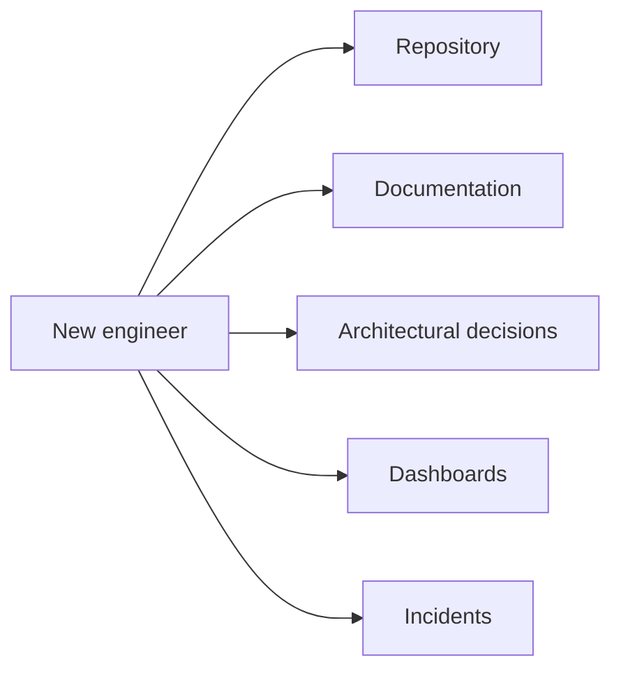
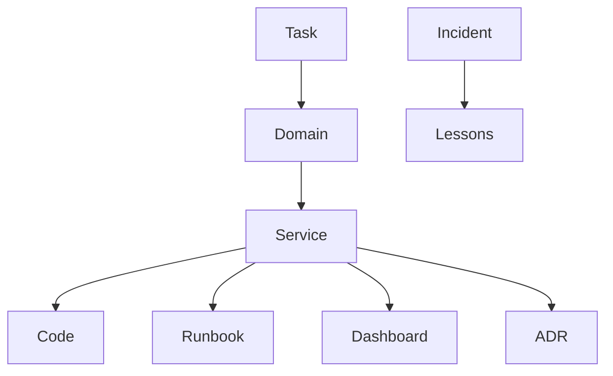

<!-- Speaker notes: Keep the opening conversational. Establish the new-person analogy before introducing technical vocabulary. -->

A practical architecture for humans and AI agents

  

    <h1 class="hero-title">Building AI-Friendly Software Architecture</h1>
    
Designing systems that can be understood, explored, and changed safely

    
Luiz Schons · Senior Software Engineer

  

  

    
Human engineer

    
AI agent

    
Code

    
Context

    
Production signals

  

---

# Is your software ready to be understood by an AI?

  

    
AI can read code.

    
That does not mean it understands the system.

  

  

    
?

    
The problem may be context, not intelligence.

  

<!-- The first article frames AI as a new person entering an unfamiliar company. -->

---

# Imagine a new engineer joining your team

  
The domain

  
The systems

  
The decisions

  
The operational reality

How much of this knowledge lives only in people’s heads?

---

# People need paths to discover knowledge

---

# An agent faces the same onboarding problem

  

    
Experienced engineer

    <h3>Uses memory and shortcuts</h3>
    
“I know where to look.”

  

  

    
AI agent

    <h3>Needs explicit paths</h3>
    
“Where does the answer live?”

  

---

# The common diagnosis

  
When an agent makes a mistake, we often say:

  <h2 class="text-7xl">“The model is not good enough.”</h2>
  
Sometimes the system simply hides too much context.

---

# Code is only part of the story

  

    
{ }

    
Code shows implementation

  

  

    
Code does not always explain:

    <ul>
      <li>Why the decision exists</li>
      <li>Which trade-offs were accepted</li>
      <li>Which constraints matter</li>
      <li>How the system behaves in production</li>
    </ul>
  

---

# Having information is not the same as having context

  

    
Code

    
Tickets

    
Dashboards

    
ADRs

    
Incidents

  

  

    
Context is the path between them.

    
AI-friendly architecture makes that path discoverable.

  

---

# The context architecture

<!-- This is the first technical definition of Context Architecture. Pause here and name the links, not just the sources. -->

---

# The system should tell its own story

  
Discoverable context

  
→ better decisions

  
→ safer changes

Prototype complete. The full narrative and extended OpenTelemetry section live in the source outline.

